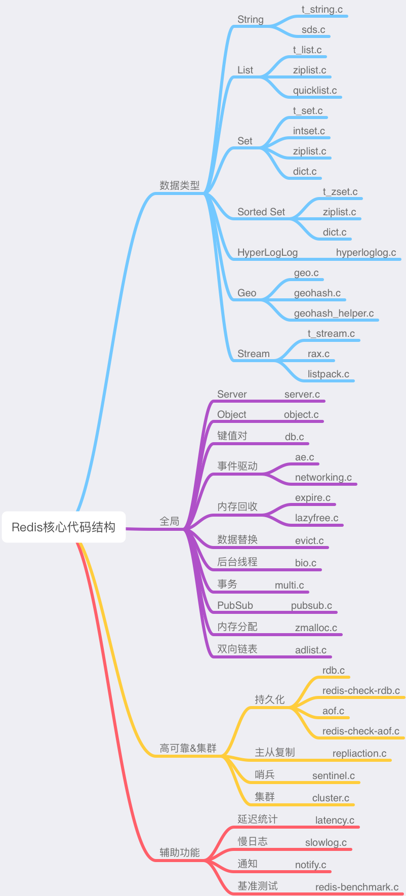

test:（测试）
1.memtest.c 内存检测
2.redis_benchmark.c 用于redis性能测试的实现。
3.redis_check_aof.c 用于更新日志检查的实现。
4.redis_check_dump.c 用于本地数据库检查的实现。
5.testhelp.c 一个C风格的小型测试框架。

struct:（结构体）
1.adlist.c 用于对list的定义，它是个双向链表结构
2.dict.c 主要对于内存中的hash进行管理
3.sds.c 用于对字符串的定义
4.sparkline.c 一个拥有sample列表的序列
5.t_hash.c hash在Server/Client中的应答操作。主要通过redisObject进行类型转换。
6.t_list.c list在Server/Client中的应答操作。主要通过redisObject进行类型转换。
7.t_set.c  set在Server/Client中的应答操作。主要通过redisObject进行类型转换。
8.t_string.c string在Server/Client中的应答操作。主要通过redisObject进行类型转换。
9.t_zset.c zset在Server/Client中的应答操作。主要通过redisObject进行类型转换。
10.ziplist.c  ziplist是一个类似于list的存储对象。它的原理类似于zipmap。
11.zipmap.c  zipmap是一个类似于hash的存储对象。

data:（数据操作）
1.aof.c 全称为append only file，作用就是记录每次的写操作,在遇到断电等问题时可以用它来恢复数据库状态。
2.config.c 用于将配置文件redis.conf文件中的配置读取出来的属性通过程序放到server对象中。
3.db.c对于Redis内存数据库的相关操作。
4.multi.c用于事务处理操作。
5.rdb.c  对于Redis本地数据库的相关操作，默认文件是dump.rdb（通过配置文件获得），包括的操作包括保存，移除，查询等等。
6.replication.c 用于主从数据库的复制操作的实现。

tool:（工具）
1.bitops.c 位操作相关类
2.debug.c 用于调试时使用
3.endianconv.c 高低位转换，不同系统，高低位顺序不同
4.help.h  辅助于命令的提示信息
5.lzf_c.c 压缩算法系列
6.lzf_d.c  压缩算法系列
7.rand.c 用于产生随机数
8.release.c 用于发步时使用
9.sha1.c sha加密算法的实现
10.util.c  通用工具方法
11.crc64.c 循环冗余校验

event:（事件）
1.ae.c 用于Redis的事件处理，包括句柄事件和超时事件。
2.ae_epoll.c 实现了epoll系统调用的接口
3.ae_evport.c 实现了evport系统调用的接口
4.ae_kqueue.c 实现了kqueuex系统调用的接口
5.ae_select.c 实现了select系统调用的接口

baseinfo:（基本信息）
1.asciilogo,c redis的logo显示
2.version.h定有Redis的版本号

compatible:（兼容）
1.fmacros.h 兼容Mac系统下的问题
2.solarisfixes.h 兼容solary下的问题

main:（主程序）
1.redis.c redis服务端程序
2.redis_cli.c redis客户端程序

net:（网络）
1.anet.c 作为Server/Client通信的基础封装
2.networking.c 网络协议传输方法定义相关的都放在这个文件里面了。

wrapper:（封装类）
1.bio.c background I/O的意思，开启后台线程用的
2.hyperloglog.c 一种日志类型的
3.intset.c  整数范围内的使用set，并包含相关set操作。
4.latency.c 延迟类
5.migrate.c 命令迁移类，包括命令的还原迁移等
6.notify.c 通知类
7.object.c  用于创建和释放redisObject对象
8.pqsort.c  排序算法类
9.pubsub.c 用于订阅模式的实现，有点类似于Client广播发送的方式。
10.rio.c redis定义的一个I/O类
11.slowlog.c 一种日志类型的，与hyperloglog.c类似
12.sort.c 排序算法类，与pqsort.c使用的场景不同
13.syncio.c 用于同步Socket和文件I/O操作。
14.zmalloc.c 关于Redis的内存分配的封装实现

others:（存放了一些我暂时还不是很清楚的类,所以没有解释了）
1.scripting.c
2.sentinel.c
2.setproctitle.c
3.valgrind.sh
4.redisassert.h
————————————————
版权声明：本文为CSDN博主「Android路上的人」的原创文章，遵循CC 4.0 BY-SA版权协议，转载请附上原文出处链接及本声明。
原文链接：https://blog.csdn.net/Androidlushangderen/article/details/39803337

